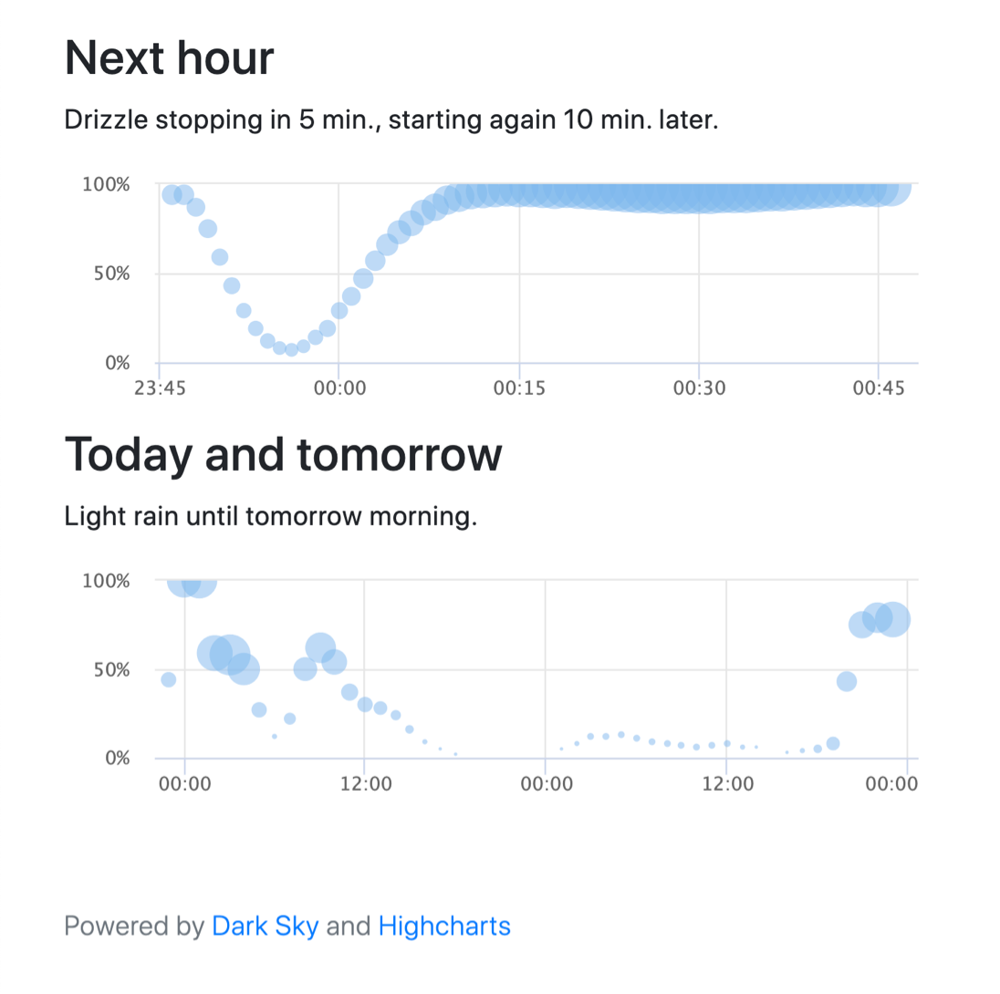

# DarkskyRain
Simple "is it going to rain?" visualisation using the [Dark Sky API](https://darksky.net/dev) and [Highcharts](https://www.highcharts.com/). Shows probablity charts for the next hour and the next 48 hours. Rain intensity is indicated by bubble size.

